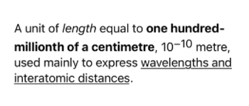
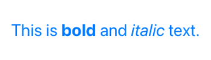
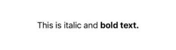
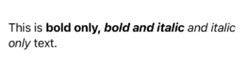
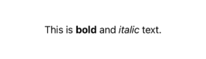
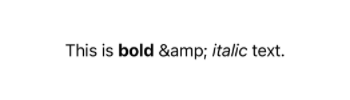
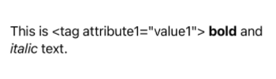

# AttributedText

AttributedText is a view for displaying some HTML-tagged text using **SwiftUI Text View**.

A simple example of usage.

**Code example:**

```swift
AttributedText("A unit of <i>length</i> equal to <b>one hundred-millionth of a centimetre</b>, 10<sup>−10</sup> metre, used mainly to express <u>wavelengths and interatomic distances</u>.")
```

**Result:**




## Features

1. Basic modifiers can still be applied, such as changing the font and color of the text.

   **Code example:**

   ```swift
   AttributedText("This is <b>bold</b> and <i>italic</i> text.")
       .foregroundColor(.blue)
       .font(.title)
   ```

   **Result:**

   

2. Handles unopened/unclosed tags.

   **Code example:**

   ```swift
   AttributedText("This is italic</i> and <b>bold text.")
   ```

   **Result:**

   

3. Supports overlapping tags.

   **Code example:**

   ```swift
   AttributedText("This is <b>bold only, <i>bold and italic</b> and italic only</i> text.")
   ```

   **Result:**

   

4. Deletes tags that have no modifiers.

   **Code example:**

   ```swift
   AttributedText("<unknown>This is <b>bold</b> and <i>italic</i> text.</unknown>")
   ```

   **Result:**

   
   
5. Does **not** handle HTML characters such as `&amp;`.

   **Code example:**

   ```swift
   AttributedText("This is <b>bold</b> &amp; <i>italic</i> text.")
   ```

   **Result:**

   
   
6. **Only single-word tags are supported**. Tags with more than one word or containing any characters besides letters are ignored and not deleted.

   **Code example:**

   ```swift
   AttributedText("This is <tag attribute1=\"value1\"> <b>bold</b> and <i>italic</i> text</tag>.")
   ```

   **Result:**

   


## Installation and usage

1. Manually add **AttributedText.swift** and **HTML2TextParser.swift** files to your project.

2. Modify or complement the **availableTags** dictionary in the **HTML2TextParser** class.

   You need to add the required tags and provide associated closures. Each closure must be a modifier that is applied to the SwiftUI Text View when a specific tag is encountered. For example:

   ```swift
   private let availableTags: Dictionary<String, (Text) -> (Text)> = [
       "b": { $0.bold() },
       "i": { $0.italic() }
   ]
   ```

   In this case only **\<b\>** and **\<i\>** tags will be processed. All other tags will be ignored or deleted.

